# Credit Card Fraud Detection 🚀💳

[](https://www.python.org/) [](https://spark.apache.org/) [](https://kafka.apache.org/) [](LICENSE)

**Credit Card Fraud Detection** is a state-of-the-art real-time streaming analytics solution designed to detect fraudulent credit card transactions instantly. By harnessing the power of Apache Spark, Kafka, and HBase, this project combines dynamic rule-based evaluation, geo-spatial analysis, and historical data enrichment to secure financial transactions.

---

## 📖 Table of Contents

- [Overview](#overview)
- [Key Features](#key-features)
- [Architecture](#architecture)
- [Project Structure](#project-structure)
- [Installation](#installation)
- [Usage](#usage)
- [Testing & Evaluation](#testing--evaluation)
- [Contributing](#contributing)
- [License](#license)
- [Acknowledgements](#acknowledgements)

---

## 🔍 Overview

Fraudulent transactions are one of the biggest challenges facing financial institutions today. Our solution processes transaction data in real time, enriches it with geo-location and historical insights, and uses a smart rules engine to classify transactions as **GENUINE** or **FRAUD**. This project is built with scalability and modularity in mind, making it easy to extend and adapt for evolving fraud detection needs.

---

## ✨ Key Features

- **⚡ Real-Time Streaming:**  
  Seamlessly consumes live transactions from Kafka using Spark Structured Streaming.

- **📍 Geo-Spatial Analysis:**  
  Utilizes CSV-based mapping of ZIP codes to compute accurate distances and risk factors.

- **🛡️ Dynamic Rule Engine:**  
  Evaluates transactions against thresholds (e.g., Upper Control Limit, credit score, speed) to flag anomalies.

- **💾 HBase Integration:**  
  Efficiently retrieves and updates historical transaction data using a robust DAO module powered by HappyBase.

- **🔧 Modular Design:**  
  Clean, organized code structure ensures ease of maintenance, scalability, and future enhancements.

---

## 🏗️ Architecture

```mermaid
flowchart TD
    A[📥 Kafka: Transaction Stream] --> B[⚡ Spark Streaming]
    B --> C[🔍 Data Parsing & Enrichment]
    C --> D[💾 HBase Lookup & Update]
    D --> E[🛡️ Rule Engine Evaluation]
    E --> F{💡 Transaction Status}
    F -- Genuine --> G[✅ Forward to downstream systems]
    F -- Fraudulent --> H[🚨 Alert & Monitor]
```



**Workflow:**

1. **Data Ingestion:**  
   - Kafka streams live transaction data into Spark.

2. **Stream Processing:**  
   - Spark parses, timestamps, and enriches data with geo-location and historical HBase records.

3. **Rule Evaluation:**  
   - The rule engine applies custom logic to determine if a transaction is genuine or fraudulent.

4. **Data Update & Monitoring:**  
   - HBase is updated with enriched transaction data, and the results are output in real time.

*Tip: Replace the placeholder diagram above with your actual architecture image if available!*

---

## 🗂️ Project Structure

```plaintext
Credit-card-fraud-detection/
├── data/
│   └── uszipsv.csv           # 📍 CSV mapping ZIP codes to geo-coordinates
├── db/
│   ├── dao.py               # 💾 HBase DAO for read/write operations
│   └── geo_map.py           # 🌍 Geo-spatial utilities for location calculations
├── rules/
│   └── rules.py             # 🛡️ Rule engine for fraud detection logic
├── driver.py                # 🚀 Main Spark streaming application
├── LogicFinal.pdf           # 📄 Detailed design explanation and architecture
├── requirements.txt         # 📦 List of Python dependencies
└── README.md                # 📖 Project documentation (this file)
```

Each module is organized to promote clean code, easy debugging, and straightforward enhancements.

---

## 💻 Installation

### Prerequisites

- **Python 3.8+**
- **Apache Kafka** (Ensure your Kafka broker is running)
- **Apache Spark** (with Structured Streaming capabilities)
- **HBase** (with HappyBase for Python)

### Setup Steps

1. **Clone the Repository:**

   ```bash
   git clone https://github.com/yourusername/Credit-card-fraud-detection.git
   cd Credit-card-fraud-detection
   ```

2. **Set Up a Virtual Environment:**

   ```bash
   python -m venv venv
   source venv/bin/activate  # For Windows: venv\Scripts\activate
   ```

3. **Install Dependencies:**

   ```bash
   pip install -r requirements.txt
   ```

4. **Configure External Services:**  
   Ensure Kafka and HBase are up and running, and update connection settings in the code if needed.

---

## 🚀 Usage

### Starting the Application

1. **Start Kafka & HBase:**  
   Make sure your Kafka broker and HBase server are active.

2. **Run the Application:**

   ```bash
   python driver.py
   ```

   The application will:
   - Consume transactions from Kafka.
   - Enrich data with geo-location and historical insights from HBase.
   - Evaluate transactions using the rule engine.
   - Update HBase and display real-time transaction statuses on the console.

### Monitoring

- **Console Output:**  
  Monitor real-time transaction statuses and alerts directly in your terminal.

- **HBase Shell:**  
  Use commands like `list` and `scan look_up_table` to inspect updated data.

---

## 🔍 Testing & Evaluation

- **Simulated Transactions:**  
  Test the entire pipeline using simulated data or test streams from Kafka.

- **Performance Metrics:**  
  Extend the evaluation framework with metrics like ROC-AUC, precision, recall, and F1-score for a comprehensive analysis.

- **Deep Dive Documentation:**  
  Refer to [LogicFinal.pdf](./LogicFinal.pdf) for an in-depth explanation of the design and processing flow.

---

## 🤝 Contributing

We welcome contributions to improve this project! Here’s how you can get involved:

1. **Fork the Repository**
2. **Create a Feature Branch:**

   ```bash
   git checkout -b feature/your-feature-name
   ```

3. **Commit Your Changes:**

   ```bash
   git commit -m "Add feature or fix issue"
   ```

4. **Push the Branch and Open a Pull Request:**  
   Provide a detailed description of your changes for review.

---

## 📜 License

This project is licensed under the MIT License. See the [LICENSE](LICENSE) file for more details.


---

## 🙏 Acknowledgements

- **Inspiration & Guidance:**  
  A huge thank you to upGrad Education and the open-source community for their continuous support and inspiration.

- **Core Technologies:**  
  Special thanks to the teams behind Apache Kafka, Apache Spark, HBase, and HappyBase.

- **Community:**  
  We appreciate all the contributors who have helped improve this project.

-  *If you like the project please provide a star 🌟 * 
---

*Happy coding and safe transactions! 🚀💳*


